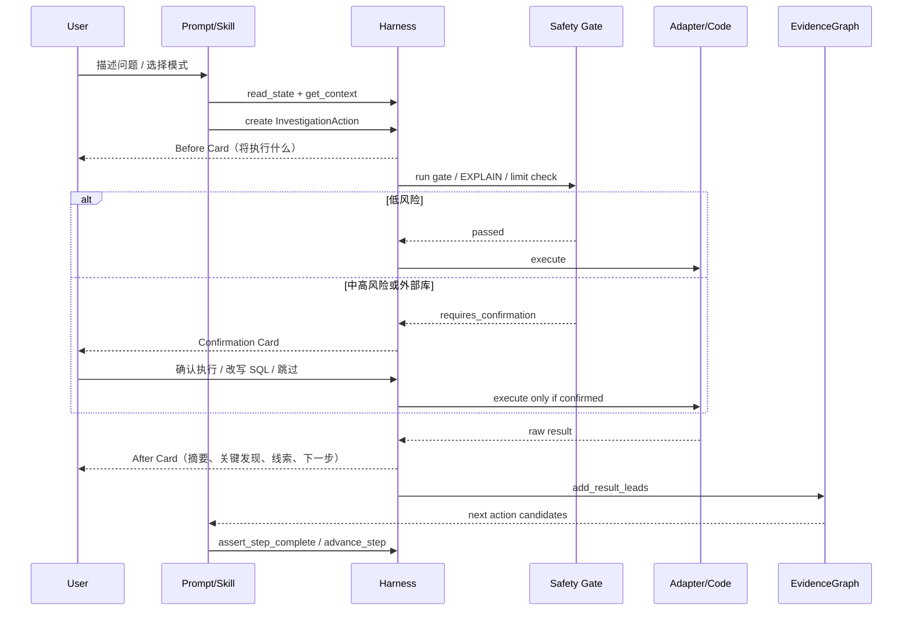

# Compass（罗盘）Harness 版设计文档

> 版本：v3.0-harness | 日期：2026-04 | 状态：设计稿
>
> 变更摘要：在 v2.0 基础上引入完整 Harness 层——状态机、上下文注入器、传感器体系、压缩器。
> Context 层从"AI 自己判断读什么"升级为"工具精准注入"。
> Prompt 层大幅瘦身，细节全部下沉到 Harness 工具执行。

## 实现状态同步（2026-04-09）

当前仓库已完成首轮 v3 结构化落地（与本设计稿对齐）：

- 已新增 `tools/`（`session_state/context_injector/sensors/compressor/tool_protocol`）
- 已新增 `guards/flow-checkpoints.md`
- 已新增 `memory/session-state.yaml`、`memory/user-decisions.yaml`、`memory/audit-log.yaml`、`memory/strategies.yaml`
- 已将 `guards/context-limits.yaml` 切换为 token 阈值模型
- 已将 5 个 adapter 的 `health_check` 统一为结构化返回

仍需持续增强的部分：

- 注入器的细粒度裁剪策略目前为最小可运行版本，后续可按服务和页面关键词继续精细化
- 端到端场景回放测试仍需补充更多真实问题样本

## 实现状态同步（2026-04-16）

本轮在 v3 Harness 基础上补齐 **Action Card Protocol**，解决“执行前没有清晰展示要做什么、执行后没有结构化沉淀线索、高风险门禁没有形成可见确认入口”的问题：

- 已新增 `tools/action_cards.py`，统一表达 `InvestigationAction / SafetyGateResult / ActionResult`，负责执行前卡片、门禁卡片、执行后卡片和 `pending_confirmation`。
- 已新增 `tools/sql_gate.py`，解析 Doris EXPLAIN 中的 `cardinality / partitions / tablets / VOlapScanNode / predicates`，把 SQL 风险判定转成结构化 Safety Gate。
- 已新增 `tools/evidence_graph.py`，把页面、API、方法、表、traceId、Redis key 等线索沉淀为证据图。
- 已更新 `SKILL.md`、`tools/tool_protocol.md`、`prompts/query-planning.md`、`prompts/result-analysis.md`、`guards/sql-safety.md`，要求每个动作必须按 `Before Card → Safety Gate → 执行或暂停 → After Card → EvidenceGraph` 顺序推进。
- 已新增单测覆盖 Action Card 渲染、高风险 SQL 确认、Doris EXPLAIN 风险判定、证据图节点/边生成。

## 实现状态同步（2026-04-16，安装配置）

本轮收敛安装后的用户配置口径：

- 用户手动准备的核心配置文件只有 `.env`。
- 最小可用配置只有 `CODE_ROOT`；数据源凭证按 SLS / Platform / MySQL / Redis / ES 能力按需填写。
- `config/code-repos.yaml` 通常自动生成或使用默认配置，目录特殊时才手动编辑。
- 已新增 `tools/setup_check.py`，用于检测 `.env`、`CODE_ROOT`、各 adapter 环境变量配置状态。
- 已更新 `prompts/setup.md`，移除旧的 MCP 优先口径，改成 `.env + adapter health_check` 的安装后引导。

---

## 目录

- [第一章：背景与目标](#第一章背景与目标)
- [第二章：三层架构模型](#第二章三层架构模型)
- [第三章：目录结构](#第三章目录结构)
- [第四章：Harness 层——核心设计](#第四章harness-层核心设计)
- [第五章：Context 层升级](#第五章context-层升级)
- [第六章：Adapter 能力层](#第六章adapter-能力层)
- [第七章：Guards 安全门控层](#第七章guards-安全门控层)
- [第八章：Prompts 提示词层](#第八章prompts-提示词层)
- [第九章：排查主流程](#第九章排查主流程)
- [第十章：自我进化机制](#第十章自我进化机制)
- [第十一章：Agent 架构与执行模式](#第十一章agent-架构与执行模式)
- [第十二章：部署与 Checklist](#第十二章部署与-checklist)
- [附录 A：术语表](#附录-a术语表)
- [附录 B：agent.md 完整提示词](#附录-bagentmd-完整提示词)

---

## 第一章：背景与目标

### 1.1 现状与痛点

云快充业务体系包含 30+ 微服务，覆盖 C 端（用户 App）和 B 端（omp-shop 商户管理后台）。线上问题排查面临以下困境：

**数据分散**：排查一个问题通常需要横跨 SLS 日志、Doris 数据仓库、甚至多个服务的代码，手动在多个系统间切换、拼接查询语句，效率极低。

**经验难沉淀**：每位开发者都有自己习惯的排查路径和关键字，新人面对同类问题需要从头摸索。排查经验散落在个人脑中，无法被团队复用。

**C 端与 B 端割裂**：C 端无前端代码，只能通过日志和数据反推用户行为；B 端有完整的 omp-shop 前端，可以通过「页面 → 接口 → 日志」三层联动定位问题。两种排查路径完全不同，目前没有统一的方法论。

**安全性缺失**：直接在生产数据库上执行 SQL 没有任何防护，存在误执行高代价查询（全表扫描亿级数据）甚至误操作的风险。

**v2.0 遗留的工程问题**：v2.0 已经解决了数据孤岛和经验沉淀问题，但在长流程执行上暴露了新的痛点：

- AI 读完所有文档后靠"理解"执行，上下文越来越大，形成大杂烩
- 流程约束是文字声明，AI 容易跳步、漏步、提前收官
- 没有任何系统在运行时监督 AI 是否按规则走
- 日志轨"只查关键字就停"、策略归档被跳过等问题反复出现

v3.0 的核心任务是引入 Harness 层，从根本上解决上述工程问题。

### 1.2 目标

构建一个具备完整 Harness 能力的 OpenClaw Agent Skill，名为 `compass`（罗盘），在 v2.0 基础上实现：

| 目标 | 描述 |
|------|------|
| **自然语言驱动** | 用户用自然语言描述问题，AI 自动识别实体、规划查询 |
| **内置查询能力** | 通过 Python 脚本直接调用 SLS SDK、平台 HTTP、MySQL、Redis、ES |
| **安全门控** | SQL 三档 EXPLAIN 强卡、内部库优先、外部库确认、数据脱敏、审计日志 |
| **Harness 驱动流程** | 状态机记录流程进度，上下文注入器精准喂料，传感器实时监控，压缩器控制体积 |
| **自我进化** | 每次排查后自动归档策略，基于用户反馈调整策略权重 |
| **用户监督** | 所有关键决策必须经用户确认，Harness 工具负责强制执行，不依赖 AI 自觉 |

### 1.3 v3.0 与 v2.0 的核心差异

| 维度 | v2.0 | v3.0 |
|------|------|------|
| 流程管理 | AI 凭文字规则自己决定步骤 | 状态机工具记录、检查、推进步骤 |
| 上下文 | AI 自己判断读哪些文件 | 注入器按步骤精准裁剪注入 |
| 约束执行 | 文档声明"强卡"，AI 自觉 | 传感器检测 + 工具返回拦截信号 |
| 上下文体积 | 越跑越大，靠 AI 判断是否压缩 | 压缩器按触发规则自动执行 |
| 错误处理 | 被动（出错后 AI 自己处理） | 主动（传感器提前检测，结构化信号） |

### 1.4 成功标准

- 一个完整排查流程从用户描述到定位原因，平均交互轮次 ≤ 5 轮
- 日志轨四步完成率 100%，不出现"只查关键字就停"
- prod SQL 100% 经过 EXPLAIN 三档强卡，0 条未经确认的写操作
- 长流程（8步全走完）中 AI 跳步率为 0（状态机兜底）
- 上下文体积在任意步骤不超过 80,000 tokens（压缩器保障）

---

## 第二章：三层架构模型

### 2.1 为什么需要三层

v2.0 的核心问题是：**AI 既是执行者，又是裁判，又是监督者**。这三个角色全由一个 AI 扮演，在短流程里勉强可以，在长流程里必然失控。

v3.0 引入三层模型，把这三个角色明确分开：

```
┌─────────────────────────────────────────────────────┐
│              Harness 层（监督者）                     │
│  状态机 · 注入器 · 传感器 · 压缩器 · 工具调用协议      │
│  负责：流程编排、上下文管理、运行时检测、自动纠偏        │
└──────────────────────┬──────────────────────────────┘
                       │ 控制 + 喂料
┌──────────────────────▼──────────────────────────────┐
│              Context 层（信息环境）                   │
│  按步骤精准注入的上下文包：知识/策略/规则/状态          │
│  负责：让 AI 在每一步都有且只有它需要的信息            │
└──────────────────────┬──────────────────────────────┘
                       │ 驱动
┌──────────────────────▼──────────────────────────────┐
│              Prompt 层（执行者）                      │
│  SKILL.md · Prompts · Guards · AI 推理               │
│  负责：在 Harness 给定的上下文中完成具体的判断和执行    │
└─────────────────────────────────────────────────────┘
```

三层的关键关系：**Harness 控制 Context，Context 驱动 Prompt**。AI 的推理发生在 Prompt 层，但它能看到什么、被允许做什么、结果是否合格，全部由 Harness 层决定。

### 2.2 各层职责边界

**Harness 层**负责所有"流程性"的事：我现在在哪一步、该给 AI 看什么信息、AI 做的对不对、上下文是否需要压缩。Harness 层的核心实现是一组 Python 工具，这些工具以结构化方式返回信号，AI 必须调用并遵循返回值。

**Context 层**是 Harness 层的输出产物。每次 AI 需要信息时，它调用注入器工具，注入器返回当前步骤精确裁剪过的内容包，不是文件路径，是已经读好、压缩过、格式化好的内容字符串。Context 层本身不做决策，只是 Harness 层组装好的"信息托盘"。

**Prompt 层**是 AI 真正做推理的地方。它接收 Context 层给的信息，按 prompts/ 目录下的规范做判断和执行。Prompt 层应该尽可能"薄"——只包含推理规则，不包含流程编排，不包含上下文管理，这两件事交给上面两层。

### 2.3 工具即协议

v3.0 的一个关键设计思想是：**工具调用是协议，不是建议**。

v2.0 里的 "强卡" 是文字声明，AI 可以选择不遵守。v3.0 里，每个关键检查点都有对应的工具调用，工具返回的信号是结构化的（JSON），AI 必须在下一步引用这个返回值。如果返回 `{"ok": false}`，AI 不能继续——因为它的下一步提示词明确写着"必须先看 assert_step 的返回值"。

这样，约束从"AI 自觉"变成了"系统强制"。

### 2.4 完整运行架构图

```
┌────────────────────────────────────────────────────────────────────────────┐
│                              User / Operator                              │
│         自然语言问题、截图、账号、订单号、时间范围、确认/跳过/改写指令        │
└──────────────────────────────────┬─────────────────────────────────────────┘
                                   │
                                   ▼
┌────────────────────────────────────────────────────────────────────────────┐
│                            Prompt / Skill 层                               │
│  SKILL.md                                                                  │
│  ├─ 首轮模板：问题复述 / 实体识别 / 场景判断 / 方案确认                     │
│  ├─ 强制规则：单线顺序、内部 adapter 优先、禁止写操作、结果脱敏              │
│  └─ Action Card Protocol：任何动作前必须生成 InvestigationAction            │
│                                                                            │
│  prompts/                                                                  │
│  ├─ query-planning.md：三轨协作、Before/After、Safety Gate、收敛门控         │
│  └─ result-analysis.md：结论卡片、完整流程、证据图、推断链                  │
│                                                                            │
│  guards/                                                                   │
│  ├─ sql-safety.md：prod SQL EXPLAIN 三档门禁 + pending_confirmation          │
│  ├─ redis-safety.md / es-safety.md：只读白名单和范围限制                    │
│  └─ data-masking.md：展示前脱敏                                             │
└──────────────────────────────────┬─────────────────────────────────────────┘
                                   │ 调用工具即协议
                                   ▼
┌────────────────────────────────────────────────────────────────────────────┐
│                              Harness 工具层                                 │
│                                                                            │
│  session_state.py                                                          │
│  ├─ read_state / write_state                                               │
│  ├─ mark_checkpoint / assert_step_complete / advance_step                   │
│  └─ pending_confirmations：保存中/高风险等待用户确认的动作                  │
│                                                                            │
│  context_injector.py                                                       │
│  └─ 按 Step 注入 prompts / guards / strategies / topology                   │
│                                                                            │
│  action_cards.py                                                           │
│  ├─ InvestigationAction：执行前声明目的、工具、环境、查询对象、成功标准       │
│  ├─ SafetyGateResult：门禁结果、风险等级、是否需要确认                       │
│  ├─ ActionResult：执行后摘要、关键发现、提取线索、下一步候选                 │
│  └─ render_before_card / render_safety_gate_card / render_after_card        │
│                                                                            │
│  sql_gate.py                                                               │
│  └─ parse_doris_explain / assess_sql_explain                                │
│                                                                            │
│  evidence_graph.py                                                         │
│  └─ 页面 / API / 方法 / 表 / traceId / key 节点与关系沉淀                   │
│                                                                            │
│  sensors.py / compressor.py                                                │
│  ├─ 流程偏离、空结果、日志轨完成度、上下文体积检测                           │
│  └─ 超阈值时压缩上下文                                                      │
└──────────────────────────────────┬─────────────────────────────────────────┘
                                   │ 只有门禁通过或用户确认后才能执行
                                   ▼
┌────────────────────────────────────────────────────────────────────────────┐
│                              Action Executor                               │
│                                                                            │
│  1. Plan Action                                                            │
│     └─ 生成 InvestigationAction                                            │
│  2. Render Before Card                                                     │
│     └─ 展示 SLS query / SQL / 代码应用与方法 / Redis key / ES query         │
│  3. Run Safety Gate                                                        │
│     ├─ SQL：先 EXPLAIN，再按 rows/type/key/cardinality 判定风险             │
│     ├─ SLS：时间范围、limit、上下文采样、字段裁剪                           │
│     ├─ Redis/ES：只读命令、size/from/范围限制                               │
│     └─ 外部库：内部 adapter 覆盖检查 + 用户确认                              │
│  4. Pause or Execute                                                       │
│     ├─ 🟢 低风险：自动执行                                                  │
│     └─ 🟡/🔴/外部库：写 pending_confirmation，等待「确认执行」              │
│  5. Render After Card                                                      │
│     └─ 结果摘要、关键发现、提取线索、可继续下钻方向                         │
│  6. Update EvidenceGraph                                                   │
│     └─ 把线索转成下一步候选                                                 │
└──────────────────────────────────┬─────────────────────────────────────────┘
                                   │
              ┌────────────────────┼────────────────────┐
              ▼                    ▼                    ▼
┌─────────────────────────┐ ┌─────────────────────────┐ ┌─────────────────────┐
│        代码轨            │ │        日志轨            │ │       数据轨         │
│                         │ │                         │ │                     │
│ B 端页面调用链：          │ │ SLS 四步强制：            │ │ SQL / Redis / ES：    │
│ 页面组件                 │ │ 1. 关键字宽查             │ │ 1. 表/key/index 定位  │
│ → 前端 API 常量          │ │ 2. 提取 traceId/tlogId    │ │ 2. 安全门禁           │
│ → Controller             │ │ 3. 拉全链路日志           │ │ 3. 数据状态核验       │
│ → Service/Feign          │ │ 4. 提取线索触发代码轨      │ │ 4. 反查相关表/代码/日志│
│ → Mapper/DAO             │ │                         │ │                     │
│ → 表/缓存/日志关键字       │ │                         │ │                     │
└────────────┬────────────┘ └────────────┬────────────┘ └──────────┬──────────┘
             │                           │                         │
             └───────────────────────────┼─────────────────────────┘
                                         ▼
┌────────────────────────────────────────────────────────────────────────────┐
│                              Adapter 能力层                                │
│                                                                            │
│  adapters/sls              → SLS 日志查询（prod / test / uat，内部）         │
│  adapters/mysql            → MySQL / PolarDB（test / uat，内部）             │
│  adapters/redis            → Redis 只读查询（test / uat，内部）              │
│  adapters/elasticsearch    → ES 全文检索（test-finance，内部）               │
│  adapters/platform         → Doris 分析查询（prod，外部 JDBC，需确认）        │
└──────────────────────────────────┬─────────────────────────────────────────┘
                                   │
                                   ▼
┌────────────────────────────────────────────────────────────────────────────┐
│                              输出与归档                                     │
│                                                                            │
│  result-analysis.md                                                        │
│  ├─ 结论卡片：What / Where / When / Why / Blast Radius / How                │
│  ├─ 完整排查流程：复用 Before / Safety Gate / After                         │
│  ├─ EvidenceGraph 摘要：页面 → API → 方法 → 表 → 数据状态                    │
│  └─ 建议：SQL 工单、代码修复、补日志、补索引、运营口径说明                   │
│                                                                            │
│  strategy-improvement.md                                                   │
│  └─ 反馈评分、策略沉淀、审计日志、临时文件清理                              │
└────────────────────────────────────────────────────────────────────────────┘
```

### 2.5 Action Card 执行时序图



---

## 第三章：目录结构

```
compass/
│
├── SKILL.md                          # 总入口：流程骨架 + Harness 工具清单 + 调用协议
│
├── tools/                            # ★ 新增：Harness 工具层（核心）
│   ├── README.md                     # 工具层总览：每个工具的职责、调用时机、返回格式
│   ├── session_state.py              # 状态机：读/写/断言会话状态
│   ├── context_injector.py           # 上下文注入器：按步骤精准裁剪内容
│   ├── sensors.py                    # 传感器：结果质量/流程偏离/体积/日志轨
│   ├── compressor.py                 # 压缩器：步骤间上下文摘要与丢弃
│   ├── action_cards.py               # Action Card：执行前/门禁/执行后结构化卡片
│   ├── sql_gate.py                   # SQL EXPLAIN 解析与风险判定
│   ├── evidence_graph.py             # 证据图：页面/API/方法/表/日志线索关系
│   ├── setup_check.py                # 安装后配置检查：.env、CODE_ROOT、adapter 凭证
│   └── tool_protocol.md              # 工具调用协议：AI 必须遵守的调用顺序和规则
│
├── adapters/                         # 能力适配层（基本沿用 v2.0）
│   ├── _convention.md                # adapter 开发约定
│   ├── base.py                       # adapter 公共基类
│   ├── sls/                          # SLS 日志查询（内部）
│   ├── platform/                     # Doris 分析查询（外部 JDBC，需确认）
│   ├── mysql/                        # MySQL/PolarDB（内部）
│   ├── redis/                        # Redis 只读查询（内部）
│   └── elasticsearch/                # ES 全文检索（内部）
│
├── guards/                           # 安全门控层（基本沿用 v2.0，新增流程检查点文件）
│   ├── sql-safety.md                 # ★ SQL 三档 EXPLAIN 规则（唯一权威来源）
│   ├── redis-safety.md               # Redis 命令安全分级
│   ├── es-safety.md                  # ES 操作安全分级
│   ├── data-masking.md               # 数据脱敏规则
│   ├── query-limits.yaml             # 查询限制配置
│   ├── context-limits.yaml           # ★ 上下文体积阈值（压缩器读取）
│   ├── temp-files.yaml               # 临时文件管理（含下钻读取规则）
│   └── flow-checkpoints.md           # ★ 新增：每步完成条件定义（传感器的判断依据）
│
├── prompts/                          # 提示词层（大幅瘦身，细节移交 Harness）
│   ├── entity-extraction.md          # Step 1：实体提取规范
│   ├── classify-scene.md             # Step 2：场景分类规范
│   ├── query-planning.md             # Step 4：查询规划规范（三轨协作）
│   ├── result-analysis.md            # Step 7：结果分析规范
│   ├── strategy-improvement.md       # Step 8：策略归档规范
│   ├── project-onboarding.md         # 项目入驻规范
│   ├── knowledge-onboarding.md       # 知识入驻规范
│   └── lite-flow.md                  # 轻量流程（低阶模型兼容）
│
├── knowledge/                        # 知识层（渐进积累，工具管理）
│   ├── system-topology.md            # 服务拓扑（AI 探索生成）
│   ├── data-tables/                  # 数据表文档
│   └── b-side-pages/                 # B 端页面-接口映射
│
├── projects/                         # 项目代码导航
│   └── omp-shop.md                   # B 端项目导航
│
└── memory/                           # 记忆层（Harness 工具读写）
    ├── session-state.yaml            # ★ 当前会话状态（状态机写入）
    ├── strategies.yaml               # 排查策略库
    ├── categories.yaml               # 问题分类库
    ├── user-decisions.yaml           # 用户决策记录（避免重复询问）
    └── audit-log.yaml                # 审计日志
```

**目录变化说明：**

- 新增 `tools/` 目录：这是 v3.0 最核心的新增内容，四个工具文件构成整个 Harness 层
- 新增 `guards/flow-checkpoints.md`：每步完成条件的唯一权威来源，传感器按此判断
- 新增 `memory/session-state.yaml`：状态机的持久化存储，每次 AI 调用工具时读写
- `prompts/` 目录瘦身：移除了步骤间编排逻辑（交给状态机），只保留每步的推理规范

---

## 第四章：Harness 层——核心设计

### 4.1 设计原则

**工具是系统的神经，不是 AI 的辅助**。v2.0 的 Python 脚本是 AI 的工具（AI 用它查数据）。v3.0 的 Harness 工具是系统的神经（工具监督 AI 的行为）。两者方向相反：前者是 AI 主动调用获得能力，后者是工具主动检测 AI 的状态并给出指令。

**工具返回结构化信号，不是人类可读文本**。所有 Harness 工具的返回值都是标准 JSON 格式，包含 `status`、`action`、`data`、`block_reason` 等字段。AI 的下一步行动由这些字段决定，而不是由 AI 自己解读文本后决定。

**工具调用是强制的，不是可选的**。`tool_protocol.md` 定义了每步必须调用的工具和顺序，`agent.md` 中明确写明违反工具调用协议是不可接受的行为。

### 4.2 状态机（session_state.py）

#### 4.2.1 职责

状态机是整个 Harness 层的中枢。它维护一个持久化的会话状态文件（`memory/session-state.yaml`），记录当前排查会话的所有关键信息：进行到哪一步、已提取的实体、已完成的检查点、待确认的事项、当前活跃的工具和轨道。

AI 在长流程中最容易犯的错误是"忘记自己在哪"。状态机解决的就是这个问题：无论上下文多长、多混乱，AI 只需要调用 `read_state()` 就能精确知道当前位置和待办事项。

#### 4.2.2 数据结构（session-state.yaml）

```yaml
# memory/session-state.yaml
# 由 session_state.py 管理，AI 不直接编辑此文件

session_id: "sess_20260401_001"
created_at: "2026-04-01T10:00:00"
updated_at: "2026-04-01T10:23:45"

# 当前流程状态
flow:
  current_step: 4                    # 当前在第几步（1-8）
  completed_steps: [1, 2, 3]         # 已完成的步骤列表
  execution_mode: "auto"             # auto / manual
  scene: "C端"                       # C端 / B端
  started_at: "2026-04-01T10:00:00"

# 实体池（Step 1 提取，后续步骤增量更新）
entities:
  user_id: "138xxxx5678"
  order_id: null
  service_name: "charge-service"
  time_range: "2026-04-01 09:00~10:00"
  keywords: ["充电失败", "超时"]
  extra: {}                          # 排查过程中新发现的实体

# 检查点状态（传感器写入，状态机维护）
checkpoints:
  step_4:
    query_plan_shown: true
    user_confirmed_mode: true
    track_declared: true             # 三轨声明已输出
  step_5:
    explain_passed: false
    explain_risk_level: null
  step_6:
    log_track:
      keyword_searched: true
      trace_id_extracted: false
      full_chain_pulled: false
      code_track_triggered: false
    active_adapter: "sls"
    active_track: "日志轨"
  step_8:
    feedback_collected: false
    strategy_archived: false
    temp_files_cleaned: false

# 待确认事项（强制暂停时写入）
pending_confirmations: []

# 上下文体积追踪
context:
  estimated_tokens: 18500
  last_compressed_at: null
  compressed_steps: []

# 当前步骤的活跃工具
active_tools:
  adapter: "sls"
  track: "日志轨"                    # 代码轨 / 日志轨 / 数据轨

# 临时文件追踪
temp_files: []
```

#### 4.2.3 接口设计

状态机对外暴露以下接口，AI 通过工具调用使用：

**`read_state()`**
- 调用时机：每步开始前（强制）
- 返回：完整的 session-state 快照
- 作用：让 AI 精确知道当前步骤、已完成项、待确认项

**`write_state(patch: dict)`**
- 调用时机：每步结束后（强制）
- 参数：只传需要更新的字段（增量 patch）
- 作用：持久化当前进度，防止长上下文中信息丢失

**`assert_step_complete(step: int) -> AssertResult`**
- 调用时机：准备进入下一步之前（强制）
- 返回：`{"ok": true}` 或 `{"ok": false, "missing": [...], "block_reason": "..."}`
- 作用：这是流程不跳步的核心保障。返回 `ok: false` 时，AI 被明确要求补完缺失项，不得继续
- 判断依据：读取 `guards/flow-checkpoints.md` 中定义的每步完成条件

**`advance_step(from_step: int, to_step: int) -> AdvanceResult`**
- 调用时机：`assert_step_complete` 返回 `ok: true` 后
- 返回：`{"ok": true, "new_step": N}` 或 `{"ok": false, "reason": "步骤不连续"}`
- 作用：只允许步骤顺序推进，防止跳步。`from_step` 必须等于当前状态机记录的步骤

**`mark_checkpoint(step: int, checkpoint: str, value: any)`**
- 调用时机：完成某个子步骤后（如日志轨四步中每步）
- 作用：粒度更细的进度记录，传感器据此判断子流程完成情况

**`add_pending_confirmation(item: dict)`** / **`resolve_pending(item_id: str)`**
- 作用：管理待确认事项队列，强制暂停时写入，用户确认后解除

#### 4.2.4 流程检查点定义（flow-checkpoints.md）

`guards/flow-checkpoints.md` 是每步完成条件的唯一权威来源，状态机的 `assert_step_complete` 按此文件判断。每步的完成条件包含：必须完成的检查点列表、每个检查点对应的 session-state 字段路径、不满足时的 `block_reason` 模板。

示例（仅展示格式，详细内容见 `guards/flow-checkpoints.md`）：

```
Step 4 完成条件：
  - checkpoints.step_4.query_plan_shown == true
  - checkpoints.step_4.user_confirmed_mode == true
  - checkpoints.step_4.track_declared == true
  block_reason: "Step 4 未完成：{missing_items}。必须展示查询方案并获得用户确认后才能执行查询。"

Step 6 日志轨完成条件（track == "日志轨" 时）：
  - checkpoints.step_6.log_track.keyword_searched == true
  - checkpoints.step_6.log_track.trace_id_extracted == true
  - checkpoints.step_6.log_track.full_chain_pulled == true
  - checkpoints.step_6.log_track.code_track_triggered == true
  block_reason: "日志轨四步未完成：{missing_items}。禁止输出结论。"
```

### 4.3 上下文注入器（context_injector.py）

#### 4.3.1 职责

注入器解决"上下文大杂烩"的根本问题。v2.0 中 AI 在会话开始时读取大量文件，然后在整个流程中带着这些内容。v3.0 中，AI 在每步开始时调用注入器，注入器按步骤和场景返回精确裁剪过的内容包，不是文件路径，而是已经读好、格式化好、体积受控的内容字符串。

#### 4.3.2 分步注入清单

这是注入器的核心配置，定义了每步应该注入什么、不应该注入什么：

| Step | 必须注入的内容 | 精确裁剪规则 | 明确排除 |
|------|--------------|------------|---------|
| 1 | entity-extraction.md | 完整内容（文件本身很短） | 所有 adapters、knowledge |
| 2 | classify-scene.md、categories.yaml | 完整内容 | projects、strategies |
| 3-C | projects/{匹配的服务}.md | 仅匹配服务，不读其他 | 其他 projects/\*、adapters |
| 3-B | projects/omp-shop.md、knowledge/b-side-pages/{匹配页面} | 仅匹配页面段落 | 其他知识文件 |
| 4 | query-planning.md、strategies.yaml（Top3）、system-topology（摘要） | strategies 只取 Top3 匹配策略；topology 只取摘要（<300字） | 全量 strategies、完整 topology |
| 5 | sql-safety.md 的对应风险档段落、redis-safety.md 或 es-safety.md | 按当前查询类型只取对应段落 | 整个 guards 目录的其他文件 |
| 6 | adapters/{当前轨道}/README.md、session-state（检查点部分） | 只取当前活跃 adapter；state 只取检查点字段 | 其他 adapters、完整 state |
| 7 | result-analysis.md、当前步骤采样结果 | 采样结果而非全量数据 | 原始查询返回的全量数据 |
| 8 | strategy-improvement.md、categories.yaml | 完整内容（文件本身不大） | 全量历史策略 |

#### 4.3.3 接口设计

**`get_context(step: int, scene: str, state: dict) -> ContextPackage`**

返回结构：

```json
{
  "step": 4,
  "scene": "C端",
  "estimated_tokens": 2800,
  "content": {
    "main_prompt": "...query-planning.md 的完整内容...",
    "strategies_top3": "...Top3 策略的格式化文本...",
    "topology_summary": "...系统拓扑摘要 <300字...",
    "state_snapshot": {
      "current_step": 4,
      "entities": {...},
      "execution_mode": "auto"
    }
  },
  "excluded": ["全量 strategies", "完整 topology", "所有 adapters"],
  "load_on_demand": ["adapters/sls/README.md（Step 6 再加载）"]
}
```

**`get_adapter_context(adapter_name: str) -> AdapterContext`**

单独为 Step 6 提供当前 adapter 的上下文，支持按需调用（而非在 Step 4 就预加载）。

**`estimate_tokens(content: str) -> int`**

估算内容的 token 数，供压缩器决策使用。注入器在组装内容包时会调用此方法，确保单次注入不超过预设阈值（默认 8,000 tokens）。

#### 4.3.4 按需加载原则

注入器严格遵循"不预加载"原则：

- Step 1-2 绝对不加载任何 adapter 内容
- Step 3 只加载匹配的 1 个服务文档，不加载其他服务
- Step 4 的策略库只取 Top3，不加载全量
- adapter README 只在 Step 6 开始时加载，且只加载当前活跃的那一个

### 4.4 传感器体系（sensors.py）

#### 4.4.1 设计思路

传感器是 Harness 层的眼睛。它们在 AI 执行的关键节点上进行检测，返回结构化信号，AI 必须根据信号决定下一步行动。传感器不替 AI 做决定，但它让 AI 无法忽略问题。

v3.0 中设计四类传感器，每类针对一个核心痛点。

#### 4.4.2 传感器 1：结果质量传感器（sense_query_result）

**触发时机**：每次 adapter 执行查询返回结果后（Step 6 内，每次查询必须触发）

**检测内容**：

| 信号类型 | 触发条件 | 返回的 action |
|---------|---------|-------------|
| `EMPTY_RESULT` | 返回行数为 0 | 要求给出替代路径，不得静默结束 |
| `LARGE_RESULT` | 返回行数 > 阈值（默认 500 行） | 触发四层递进处理，写临时文件 |
| `QUERY_ERROR` | adapter 返回异常 | 分类错误类型（连接/权限/语法），提供修复建议 |
| `RETRY_LIMIT` | 同一查询重试次数 ≥ 3 次 | 强制暂停，询问用户是否换方向 |
| `RESULT_OK` | 结果正常 | 继续，附带结果摘要统计 |

**返回格式**：

```json
{
  "signal": "EMPTY_RESULT",
  "severity": "warn",
  "action": "REQUIRE_ALTERNATIVE_PATH",
  "message": "查询返回 0 条结果。必须给出至少一条替代查询路径，不得直接输出'未找到相关记录'后结束。",
  "suggestions": [
    "扩大时间范围后重查",
    "换关键字重查",
    "切换到数据轨验证用户是否存在"
  ],
  "block_conclusion": true
}
```

#### 4.4.3 传感器 2：流程偏离传感器（sense_flow_deviation）

**触发时机**：每步开始时，在 `read_state()` 之后立即触发

**检测内容**：比较 AI 在上下文中声明的当前步骤 vs 状态机记录的实际步骤

**为什么需要**：AI 在长对话中可能因为上下文压力而"忘记"自己在哪一步，这个传感器是兜底防线

**返回格式**：

```json
{
  "signal": "STEP_DEVIATION",
  "declared_step": 6,
  "actual_step": 4,
  "deviation": true,
  "action": "ROLLBACK",
  "instruction": "状态机记录当前在 Step 4，检测到你声明在 Step 6。必须回到 Step 4 继续执行，不可跳步。Step 4 剩余未完成项：[用户确认执行模式]。"
}
```

#### 4.4.4 传感器 3：上下文体积传感器（sense_context_size）

**触发时机**：每轮对话结束时（由 agent.md 中的工具调用协议驱动）

**检测内容**：估算当前上下文的 token 数量，对照 `guards/context-limits.yaml` 中定义的阈值

**阈值定义（context-limits.yaml）**：

```yaml
thresholds:
  warn: 40000        # tokens：发出警告，建议压缩
  compress: 60000    # tokens：强制触发压缩器
  emergency: 80000   # tokens：紧急压缩，丢弃非核心内容
```

**返回格式**：

```json
{
  "signal": "CONTEXT_COMPRESS_REQUIRED",
  "current_tokens": 62000,
  "threshold": 60000,
  "action": "COMPRESS",
  "compress_targets": [
    {"step": 3, "content": "项目文档原始内容", "keep": "摘要"},
    {"step": 6, "content": "查询原始返回数据", "keep": "采样结果"}
  ],
  "always_keep": ["session-state", "当前步骤完成标志", "用户确认记录"]
}
```

#### 4.4.5 传感器 4：日志轨四步传感器（sense_log_track_progress）

**触发时机**：Step 6 中，每次准备进入结论阶段（Step 7）之前；轨道为日志轨时触发

**检测内容**：检查日志轨四步的完成情况，读取 session-state 中的 `step_6.log_track` 字段

**四步定义**：
1. 关键字宽查（keyword_searched）
2. 提取 traceId/tlogId（trace_id_extracted）
3. 拉全链路（full_chain_pulled）
4. 触发代码轨分析（code_track_triggered）

**返回格式**：

```json
{
  "signal": "LOG_TRACK_INCOMPLETE",
  "complete": false,
  "completed": ["关键字宽查"],
  "missing": ["提取 traceId/tlogId", "拉全链路", "触发代码轨"],
  "action": "BLOCK_CONCLUSION",
  "block_reason": "日志轨四步未完成，禁止进入结论阶段。必须先完成：提取 traceId/tlogId → 拉全链路 → 触发代码轨。"
}
```

### 4.5 压缩器（compressor.py）

#### 4.5.1 职责

压缩器在特定触发点将已完成步骤的原始内容压缩为摘要，释放上下文空间。它不是靠 AI 自己判断要不要压缩，而是由体积传感器检测到阈值后主动调用。

#### 4.5.2 压缩策略

每个步骤有不同的压缩策略，由压缩器内部配置定义：

| 触发点 | 压缩对象 | 保留内容 | 丢弃内容 |
|-------|---------|---------|---------|
| Step 3 完成后 | 项目文档原始内容 | 服务拓扑摘要（<300字）、关键 API 列表 | 完整项目文档、代码注释 |
| Step 6 完成后 | 原始查询返回数据 | 采样结果（首条+末条+所有 ERROR）、推断链 | 全量日志行、原始 JSON |
| 体积传感器触发（60k） | 当前最大内容块 | 关键结论、实体池、状态快照 | 中间过程原始数据 |
| 体积传感器触发（80k 紧急） | 历史所有步骤内容 | session-state、当前步骤内容 | 所有已完成步骤的详细内容 |

#### 4.5.3 接口设计

**`compress(targets: list[CompressTarget], session_state: dict) -> CompressResult`**

- 参数：压缩目标列表（由体积传感器返回的 `compress_targets` 字段）
- 返回：`{"compressed": [...], "freed_tokens": 12000, "summary": "..."}`

**`summarize_step(step: int, content: str, max_tokens: int) -> str`**

- 内部使用，将某步骤的原始内容压缩为指定 token 数内的摘要
- 压缩时保留：关键结论、实体信息、用户确认记录
- 压缩时丢弃：原始查询数据、冗余中间过程

### 4.6 工具调用协议（tool_protocol.md）

`tools/tool_protocol.md` 是 AI 必须遵守的工具调用顺序规范，它被 `agent.md` 直接引用，是最高优先级约束之一。

#### 4.6.1 每轮对话的标准调用顺序

```
每轮对话开始（用户发送新消息后）：
  1. session_state.read_state()              → 获取当前状态
  2. sensors.sense_flow_deviation(...)       → 检测是否偏离
  3. context_injector.get_context(step, ...) → 获取本步上下文

每次 adapter 查询后：
  4. sensors.sense_query_result(result)      → 检测结果质量
  5. session_state.mark_checkpoint(...)      → 记录子步骤完成

准备进入下一步前：
  6. session_state.assert_step_complete(N)   → 断言当前步完成
     → ok: false → 必须补完，禁止继续
     → ok: true  → 继续执行步骤 7、8
  7. compressor.compress(...)                → 按需压缩（体积传感器触发时）
  8. session_state.advance_step(N, N+1)      → 推进步骤

每轮对话结束：
  9. sensors.sense_context_size(...)         → 检测上下文体积
  10. session_state.write_state(patch)        → 持久化状态
```

#### 4.6.2 强制暂停规则

无论当前执行模式（自动/手动），以下情况必须暂停并等待用户确认：

- `sense_query_result` 返回 `EMPTY_RESULT` 重试 3 次后
- SQL EXPLAIN 判定为 🟡 中风险或 🔴 高风险
- 需要调用外部库（platform JDBC）
- `assert_step_complete` 返回 `ok: false` 且 AI 无法自行补完（需要用户提供信息）

#### 4.6.3 工具调用违规处理

如果 AI 跳过工具调用协议（例如没有调用 `assert_step_complete` 就直接进入下一步），`agent.md` 中定义的规则要求 AI 在任何时候发现自己跳过工具调用时，必须立即回溯、补调工具、根据返回值修正行为。这是不可绕过的规则。

---

## 第五章：Context 层升级

### 5.1 v2.0 vs v3.0 的 Context 模型对比

| 维度 | v2.0 | v3.0 |
|------|------|------|
| 加载时机 | 会话开始时读取大量文件 | 每步开始时由注入器按需注入 |
| 加载粒度 | 文件级（整个 strategies.yaml） | 内容级（Top3 策略的提取文本） |
| 加载主体 | AI 自己判断要读什么 | 注入器工具决定注入什么 |
| 压缩机制 | 无，靠 AI 自觉 | 压缩器自动触发 |
| 体积控制 | 无上限，靠文档声明 | 传感器监控 + 压缩器兜底 |

### 5.2 知识层（knowledge/）的管理方式

知识层内容由注入器管理，AI 不直接读取知识文件，而是通过注入器获取裁剪后的内容。

**system-topology.md**：服务拓扑全图。注入器在 Step 4 注入时只提取摘要部分（<300字），完整拓扑在需要时通过 `get_adapter_context` 按需加载。

**data-tables/**：数据表文档。注入器按服务名过滤，只注入涉及当前排查的表结构，不注入全量表文档。

**b-side-pages/**：B 端页面映射。Step 3-B 时只注入匹配当前排查页面的段落，不注入全部页面。

### 5.3 记忆层（memory/）的读写规则

记忆层是 Harness 工具（主要是状态机）的专属读写空间。

| 文件 | 读取者 | 写入者 | 时机 |
|------|-------|-------|------|
| session-state.yaml | 状态机（read_state）、注入器 | 状态机（write_state、mark_checkpoint） | 每轮对话 |
| strategies.yaml | 注入器（Step 4 取 Top3） | AI（Step 8 归档后通过状态机写入） | 排查结束 |
| categories.yaml | 注入器（Step 2） | AI（Step 8 更新分类权重） | 排查结束 |
| user-decisions.yaml | 注入器（全流程） | 状态机（用户确认时记录） | 用户确认时 |
| audit-log.yaml | 无（只写不读） | 状态机（每次查询后写入） | 每次查询 |

**AI 不直接写 memory/ 目录的任何文件**。所有写入操作通过状态机的接口进行，状态机负责格式校验和并发安全。

### 5.4 上下文体积的精确控制

**单步注入上限**：每次 `get_context` 返回的内容包不超过 8,000 tokens（可在 context-limits.yaml 配置）

**累计体积警戒线**：

```
< 40,000 tokens  → 正常运行
40,000-60,000    → 体积传感器发出 WARN 信号，建议压缩
60,000-80,000    → 传感器触发 COMPRESS，压缩器自动执行
> 80,000         → 紧急压缩，只保留 session-state + 当前步骤内容
```

**压缩后的上下文结构**（任意时刻，上下文应该长这样）：

```
[session-state 快照]          ~500 tokens，始终保留
[当前步骤注入包]               ~3,000-8,000 tokens
[前序步骤压缩摘要]             ~500 tokens/步，压缩后
[用户确认记录]                 ~200 tokens，始终保留
[当前查询采样结果]             ~2,000 tokens
─────────────────────────────────────────
总计：通常在 10,000-20,000 tokens
```

---

## 第六章：Adapter 能力层

### 6.1 沿用 v2.0 的设计

Adapter 层在 v3.0 中基本沿用 v2.0 的设计，无结构性变化。核心约定保持不变：

- 每个 adapter 是独立目录，包含 `README.md` + `client.py` + `config.yaml` + `requirements.txt`
- 内部 adapter（sls/mysql/redis/es）直接使用，无需用户确认
- 外部 adapter（platform JDBC）每次调用前强制用户确认
- 扩展时按约定创建新目录，无需修改现有文件

### 6.2 v3.0 中的变化

**与 Harness 层的集成**：adapter 执行查询后，返回值必须传入 `sensors.sense_query_result()`，传感器的返回信号决定后续行为。adapter 本身不做结果判断，这个职责移交给传感器。

**健康检查标准化**：每个 adapter 的 `health_check()` 方法需要返回标准化的 JSON 格式：

```json
{
  "adapter": "sls",
  "status": "ok",
  "latency_ms": 120,
  "environment": "prod",
  "error": null
}
```

注入器在 Step 6 开始前会调用当前活跃 adapter 的 `health_check()`，如果返回 `status: error`，立即触发强制暂停。

### 6.3 各 Adapter 简介

**SLS（内部）**：阿里云 Simple Log Service。使用 `aliyun-log-python-sdk`。覆盖 prod/test/uat 环境。是日志轨的核心工具，四步中的关键字宽查和全链路拉取都通过 SLS 执行。

**MySQL（内部）**：MySQL/PolarDB 查询。只覆盖 test/uat 环境，prod 业务数据通过 Platform（Doris）访问。只允许 SELECT/SHOW/DESC/EXPLAIN，所有 prod 执行前必须经过 EXPLAIN 三档强卡（由 guards/sql-safety.md 定义）。

**Redis（内部）**：Redis 只读查询。只覆盖 test/uat。只允许只读命令（GET/HGET/LRANGE 等），禁止写命令（SET/DEL/FLUSH 等）。

**Elasticsearch（内部）**：全文检索。覆盖 test-finance 环境。用于订单号、用户昵称等字段的模糊搜索。

**Platform（外部 JDBC）**：Doris 分析数据查询，仅覆盖 prod。每次调用前必须输出确认提示，等用户明确确认后才执行。是 prod 环境数据查询的唯一合法入口。

---

## 第七章：Guards 安全门控层

### 7.1 安全层的角色变化

v2.0 中安全门控是"文字声明"——写在文档里，靠 AI 自觉。v3.0 中安全门控分为两类：

**文档型 Guard**（如 sql-safety.md）：定义规则，被 Harness 工具（传感器、状态机）引用，工具负责执行检查和拦截。

**配置型 Guard**（如 context-limits.yaml、query-limits.yaml）：定义阈值，被 Harness 工具在运行时读取，工具按配置自动执行。

安全层本身不变，变的是谁来执行它——从 AI 自觉变为 Harness 工具强制执行。

### 7.2 SQL 安全（guards/sql-safety.md）

SQL 三档 EXPLAIN 强卡规则与 v2.0 完全一致，是本系统中最不可变更的规则之一。

**语句白名单**：只允许 SELECT / SHOW / DESC / EXPLAIN，禁止所有 DDL/DML（INSERT/UPDATE/DELETE/DROP/ALTER/TRUNCATE/SET）。

**EXPLAIN 三档强卡（prod 环境，任何模式不可绕过）**：

```
prod 环境 SQL 生成后，传感器自动触发 EXPLAIN 执行：

🟢 低风险：rows < 10万 且 type ≠ ALL 且 key 非 NULL
   → 自动执行，输出「✅ EXPLAIN 通过（type=range, rows≈1,200, key=idx_user_id）执行中…」

🟡 中风险：rows 10万～100万；或 key=NULL 但 type ≠ ALL
   → 传感器返回 PAUSE_REQUIRED
   → 状态机写入 pending_confirmation
   → 黄色警告卡片，等待用户「确认执行」/「我来改写 SQL」/「跳过此步」

🔴 高风险：rows > 100万；或 type=ALL（全表扫描）；或 AI 综合判断有严重性能风险
   → 传感器返回 BLOCK_REQUIRED
   → 红色警告卡片，必须明确回复「确认执行」才能继续
   → 任何模式（含自动模式）均不得绕过
```

**v3.0 变化**：EXPLAIN 结果判断不再由 AI 自己看结果决定，而是由传感器的 `sense_sql_explain(explain_result)` 方法按规则计算风险等级并返回信号，AI 按信号行动。

### 7.3 Redis / ES 安全

Redis 安全分级（guards/redis-safety.md）和 ES 安全分级（guards/es-safety.md）规则沿用 v2.0，不做结构性变化。v3.0 中由传感器在执行前读取对应安全文件，按分级决定是否需要确认。

### 7.4 数据脱敏（guards/data-masking.md）

脱敏规则沿用 v2.0。v3.0 变化：脱敏不再依赖 AI 记住"展示前要脱敏"，而是在结果质量传感器（`sense_query_result`）的返回值中明确包含 `"require_masking": true` 字段，AI 在展示前必须处理此字段。

### 7.5 查询限制（guards/query-limits.yaml）

```yaml
# 查询限制配置
limits:
  max_result_rows: 500              # 超过此行数触发大结果集处理
  max_query_time_seconds: 30        # 查询超时时间
  max_retry_count: 3                # 同一查询最大重试次数
  explain_auto_threshold_rows: 100000   # EXPLAIN 自动通过阈值
  explain_warn_threshold_rows: 1000000  # EXPLAIN 警告阈值
```

### 7.6 新增：流程检查点（guards/flow-checkpoints.md）

这是 v3.0 新增的安全文件。它定义了每步的完成条件，是状态机 `assert_step_complete()` 的判断依据。详细格式见第四章 4.2.4 节。

**设计原则**：每步的完成条件以 session-state 的字段路径表示，而不是文字描述。这样传感器可以用程序直接检查，不依赖 AI 的语义理解。
---

## 第八章：Prompts 提示词层

### 8.1 v3.0 中 Prompt 层的角色

v3.0 的 Prompt 层比 v2.0 大幅瘦身。原来 prompts/ 文件承担了太多职责：流程编排、上下文加载规则、安全约束、交互格式……这些现在全部由 Harness 层承担。

v3.0 的 Prompt 文件只做一件事：**告诉 AI 在本步骤该做什么判断、输出什么格式**。流程在哪一步、上下文是什么、结果是否合格——这些全部由 Harness 工具处理。

**原则：Prompt 文件越短越好**。如果一个 Prompt 文件在描述"什么情况下才能进入下一步"，那说明这个逻辑应该在 flow-checkpoints.md 里，而不是在 Prompt 里。

### 8.2 各 Prompt 文件职责

**entity-extraction.md（Step 1）**

职责：定义实体提取的规则和输出格式。

包含内容：
- 需要识别的实体类型（userId、orgId、订单号、服务名、时间范围、关键字等）
- 识别规则：只识别不推断，缺失项标注 ❓ 并追问
- 输出格式：标准化的实体列表（供状态机写入 entities 字段）
- 禁止行为：不在本步骤发起任何查询

不包含内容：何时进入下一步（状态机管理）、需要读哪些文件（注入器管理）

---

**classify-scene.md（Step 2）**

职责：定义场景分类的判断逻辑。

包含内容：
- C 端 vs B 端的判断标准（涉及 omp-shop / 商户关键词 → B 端；否则 C 端）
- 场景分类与 categories.yaml 的映射规则
- 输出格式：`{"scene": "C端", "category": "充电失败", "confidence": "high"}`

不包含内容：分流后各路径的执行逻辑（由状态机和注入器按场景分支加载不同上下文）

---

**query-planning.md（Step 4）**

职责：定义查询规划的输出规范——三轨声明、步骤表格、执行模式选择。

包含内容：
- 三轨协作规则（🔵代码轨/🟡日志轨/🟢数据轨的适用场景和交织方式）
- 步骤表格的格式要求（含工具/数据源/预期结果/风险标注）
- 执行模式选择规则（0/1/2/3/M 的含义和适用场景）
- 策略匹配展示规则（如何展示 Top3 策略供用户参考）
- 完成标志：输出三轨声明 + 步骤表格后，等待用户确认模式

注：查询执行本身在 Step 6，本步只做规划和用户确认。

---

**result-analysis.md（Step 7）**

职责：定义结果分析和结论输出的格式规范。

包含内容：
- 结论卡片格式（问题描述/根因/证据链/建议操作）
- 排查过程卡片格式（技术用户专属：步骤表+推断链）
- 业务用户 vs 技术用户的输出差异规则
- 大结果集的四层递进处理规则（注：此规则与传感器配合，传感器检测大结果集并标记，本文件定义展示格式）
- 需要进一步查时的实体池更新规则

---

**strategy-improvement.md（Step 8）**

职责：定义策略归档的执行规范。

包含内容：
- 反馈收集格式（A/B/C/D 四选项的含义）
- 策略 YAML 的写入格式（供 AI 生成归档内容）
- 策略合并/淘汰的判断规则（何时合并相似策略、何时淘汰低分策略）
- 临时文件清理规则（引用 guards/temp-files.yaml）

触发机制：Step 7 完成后，状态机自动推进到 Step 8，不等用户说"结束了"。

---

**lite-flow.md（低阶模型兼容）**

职责：定义低阶模型（如 Claude Haiku）下的简化流程。

包含内容：
- 简化为 4 步（实体提取→查询规划→执行→结论）
- 跳过三轨协作，只走单一查询路径
- 跳过策略归档（但仍记录基本日志）
- 工具调用协议简化版（仍然需要状态机和结果传感器，但跳过体积传感器和压缩器）

---

### 8.3 Prompt 文件的格式规范

每个 Prompt 文件遵循统一格式：

```markdown
# [文件名]

## 适用步骤
Step N

## 前置条件
（由 Harness 保障，本文件不重复定义）
- 注入器已提供：[列出本步骤的注入内容]
- 状态机已确认：[列出前步完成条件]

## 执行规范
（具体的推理规则和格式要求）

## 输出格式
（标准化的输出结构）

## 禁止行为
（本步骤不允许做的事）

## 完成标志
（由 flow-checkpoints.md 定义，本文件只做引用）
→ 完整定义见 guards/flow-checkpoints.md Step N
```

---

## 第九章：排查主流程

### 9.1 主流程总览（Harness 驱动版）

v3.0 的主流程与 v2.0 的 8 步结构保持一致，但每步的执行机制发生了根本变化：步骤推进由状态机控制，上下文由注入器提供，结果由传感器检测，约束由 flow-checkpoints 强制执行。

```
用户输入自然语言描述
    │
    ▼ [Harness 启动]
    ├── read_state()                        → 获取会话状态（新会话则初始化）
    ├── sense_flow_deviation()              → 检测偏离
    └── get_context(step=1)                 → 注入 Step 1 上下文
    │
    ▼
Step 1: 实体提取 ──── prompts/entity-extraction.md
    │  AI 识别实体，缺失项追问
    │  ├── mark_checkpoint(1, "entities_extracted", true)
    │  └── write_state({entities: {...}})
    │
    ▼ [assert_step_complete(1) → ok → advance_step(1,2)]
    ├── get_context(step=2)                 → 注入 Step 2 上下文
    │
    ▼
Step 2: 场景分类 ──── prompts/classify-scene.md
    │  AI 判断 C端/B端，匹配 categories.yaml 类别
    │  ├── mark_checkpoint(2, "scene_classified", true)
    │  └── write_state({flow.scene: "C端"})
    │
    ▼ [assert_step_complete(2) → ok → advance_step(2,3)]
    ├── get_context(step=3, scene="C端/B端")  → 按场景注入不同上下文
    │
    ├─── C端 ─────────────────────────────────────────────┐
    │                                                     │
    ▼                                                     ▼
Step 3-C: 读项目文档                              Step 3-B: 页面路径发现
    注入器已加载匹配服务文档（单服务）                 注入器已加载 omp-shop.md + 匹配页面段落
    AI 识别涉及服务，理解关键逻辑                      AI 从页面→API→后端服务建立链路
    ├── mark_checkpoint(3, "service_mapped", true)       ├── mark_checkpoint(3, "page_api_mapped", true)
    └── compressor.compress(step3_raw_doc)               └── compressor.compress(step3_raw_doc)
         （Step 3 完成后立即压缩项目文档原始内容）
    │
    └──────────────────────┬──────────────────────────────┘
                           ▼ [assert_step_complete(3) → ok → advance_step(3,4)]
                           ├── get_context(step=4)     → 注入查询规划上下文
    │
    ▼
Step 4: 查询规划 ──── prompts/query-planning.md
    │  AI 输出：三轨声明（🔵🟡🟢）+ 步骤表格 + 策略 Top3 参考
    │  等待用户确认执行模式（0/1/2/3/M）
    │  ├── mark_checkpoint(4, "query_plan_shown", true)
    │  ├── mark_checkpoint(4, "track_declared", true)
    │  └── mark_checkpoint(4, "user_confirmed_mode", true)  ← 用户确认后
    │
    ▼ [assert_step_complete(4) → ok → advance_step(4,5)]
    │
    ▼
Step 5: 安全门控（每次查询前逐次触发）
    │  ├── get_context(step=5)          → 注入对应安全规则段落
    │  ├── [prod SQL] sense_sql_explain(explain_result)
    │  │     🟢 ok      → 继续
    │  │     🟡 warn    → add_pending_confirmation() → 等用户确认
    │  │     🔴 block   → add_pending_confirmation() → 必须明确确认
    │  └── [外部库] add_pending_confirmation("platform JDBC 调用确认")
    │
    ▼ [安全确认通过后]
    ├── get_context(step=6)             → 注入当前 adapter 上下文
    │
    ▼
Step 6: 执行查询 ──── adapters/<n>/client.py
    │  自动模式：全自动推进，输出进度表
    │  手动模式：每步停下确认工具/轨道
    │
    │  每次查询后：
    │  ├── sense_query_result(result)   → 检测结果质量
    │  │     EMPTY_RESULT → 给出替代路径，禁止静默结束
    │  │     LARGE_RESULT → 四层递进处理，写临时文件
    │  │     QUERY_ERROR  → 分类错误，给出修复建议
    │  │     RETRY_LIMIT  → 强制暂停
    │  │     RESULT_OK    → 继续
    │  └── mark_checkpoint(6, "log_track.xxx", true)  ← 日志轨每步完成后
    │
    │  进入 Step 7 前（日志轨）：
    │  └── sense_log_track_progress()  → 检测四步完成情况
    │        complete: false → BLOCK_CONCLUSION → 必须补完再继续
    │
    ▼ [assert_step_complete(6) → ok → compressor.compress(step6_raw_results)]
    ├── get_context(step=7)             → 注入分析上下文（采样结果而非全量）
    │
    ▼
Step 7: 结果分析 ──── prompts/result-analysis.md
    │  技术用户：结论卡片 → 排查过程卡片（步骤表+推断链）→ 明细 → 建议
    │  业务用户：结论卡片 → 建议（跳过过程卡片）
    │
    │  ├── mark_checkpoint(7, "conclusion_output", true)
    │  │
    │  ├── 需要进一步查？
    │  │     → write_state({entities: 更新后的实体池})
    │  │     → advance_step(7, 4)（回到查询规划）
    │  │
    │  └── 结论完整 → mark_checkpoint(7, "analysis_complete", true)
    │
    ▼ [assert_step_complete(7) → ok → advance_step(7,8)]
    ├── get_context(step=8)             → 注入归档上下文
    │
    ▼
Step 8: 策略归档 ──── prompts/strategy-improvement.md（自动触发，不可跳过）
    │  强制输出反馈收集（A/B/C/D）
    │  用户回复后：
    │  ├── 更新 strategies.yaml / categories.yaml
    │  ├── mark_checkpoint(8, "strategy_archived", true)
    │  ├── 清理临时文件
    │  └── mark_checkpoint(8, "temp_files_cleaned", true)
    │
    ▼ [assert_step_complete(8) → ok]
    ├── write_state({flow: 完成标记})
    └── sense_context_size() → 最终体积检查，按需压缩

会话结束
```

### 9.2 执行模式

| 模式 | 触发 | 行为 | Harness 行为 |
|------|------|------|------------|
| 自动模式（0/1/2/3） | Step 4 用户选择 | 方案确认后全自动推进，输出进度表 | 状态机自动推进步骤，传感器仍然全程监控 |
| 手动模式（M） | Step 4 用户选 M | 每步执行前停下确认工具/轨道 | 状态机在每个 `advance_step` 前写入待确认项 |

**强制暂停（任何模式均触发，由传感器和状态机强制执行）**：

- prod SQL EXPLAIN 判定为 🟡中风险或🔴高风险
- 需要调用外部库（platform JDBC）
- `sense_query_result` 返回 `RETRY_LIMIT`（重试 3 次仍无结果）
- `sense_log_track_progress` 返回 `complete: false`（日志轨未走完，尝试进入结论时）

### 9.3 三轨协作规则

三轨协作的分工和交织规则定义在 `prompts/query-planning.md` 中，此处只列出关键约束：

| 轨道 | 标记 | 适用场景 | 强制子流程 |
|------|------|---------|----------|
| 代码轨 | 🔵 | 理解业务逻辑、定位代码路径 | 无强制子流程，AI 按需读 projects/ |
| 日志轨 | 🟡 | 追踪请求链路、定位报错堆栈 | 强制四步（由日志轨传感器保障） |
| 数据轨 | 🟢 | 验证数据状态、分析数量级 | 无强制子流程，但每次执行前必须经 EXPLAIN |

日志轨四步是本系统中唯一有"子流程传感器"保障的执行路径，原因是 v2.0 中"只查关键字就停"的问题最为严重，需要硬性拦截。

### 9.4 工具优先级

```
内部 adapter（sls/mysql/redis/es）→ 直接使用
  ↓ 内部不覆盖时
platform（外部 JDBC）→ 传感器触发强制确认，等用户明确确认后才执行
  ↓
其他外部方式 → 禁止
```

### 9.5 错误处理

| 错误类型 | 传感器信号 | AI 必须执行的行为 |
|---------|----------|----------------|
| 连接失败 | `QUERY_ERROR (CONNECTION)` | 输出连接失败提示，建议检查 adapter health_check，等用户处理 |
| 权限拒绝 | `QUERY_ERROR (PERMISSION)` | 输出权限说明，建议用户确认账号权限 |
| 语法错误 | `QUERY_ERROR (SYNTAX)` | 输出错误详情，提供修正后的 SQL/DSL，重试 |
| 空结果 | `EMPTY_RESULT` | 输出替代路径至少 2 条，不得静默结束 |
| 超大结果 | `LARGE_RESULT` | 触发四层递进，写临时文件，展示摘要 |
| 重试超限 | `RETRY_LIMIT` | 强制暂停，等用户决定换方向还是放弃 |
| 超时 | `QUERY_ERROR (TIMEOUT)` | 输出超时提示，建议缩小时间范围或加条件 |

---

## 第十章：自我进化机制

### 10.1 机制概述

自我进化机制的整体设计与 v2.0 一致，核心是：每次排查后归档策略，基于用户反馈调整权重，知识库越用越准。

v3.0 的变化是：进化机制的触发和执行由 Harness 保障，不再依赖 AI 记住"结束后要归档"。

### 10.2 策略归档（Step 8，自动触发）

**触发机制**：Step 7 完成后，状态机自动推进到 Step 8，不等用户说"好了"。这是 v3.0 与 v2.0 最重要的行为差异之一。

**归档内容**（写入 memory/strategies.yaml）：

```yaml
# 每条策略的结构
strategy_id: "str_20260401_001"
problem_category: "充电失败-订单状态异常"
scene: "C端"
entities_pattern:
  required: ["userId", "time_range"]
  optional: ["orderId"]
query_steps:
  - step: 1
    track: "日志轨"
    tool: "sls"
    query_template: "关键字：{keywords} 时间：{time_range} 用户：{userId}"
    expected: "找到报错日志"
  - step: 2
    track: "日志轨"
    tool: "sls"
    query_template: "traceId: {trace_id} 拉全链路"
    expected: "找到完整链路"
success: true
feedback_score: "A"       # A=完全解决/B=部分解决/C=有线索但未解决/D=完全没帮助
weight: 1.0
created_at: "2026-04-01T11:30:00"
used_count: 1
```

**反馈收集格式**（强制输出，用户必须选择后才归档）：

```
📊 本次排查反馈

A. 完全解决——找到了根因，可以直接处理
B. 部分解决——有线索但还需要进一步排查
C. 有帮助但未解决——提供了方向，但结论不确定
D. 没有帮助——排查路径不对或结果无效

请回复 A / B / C / D
```

### 10.3 策略权重调整

**权重计算规则**：

- 用户反馈 A → weight × 1.2（上限 3.0）
- 用户反馈 B → weight × 1.05
- 用户反馈 C → weight × 0.9
- 用户反馈 D → weight × 0.5（下限 0.1）

**Top3 策略选取规则**（注入器在 Step 4 使用）：

按 `问题分类匹配度（精确/模糊/相关）× weight × used_count` 综合评分取前三。

### 10.4 策略压缩（防膨胀）

当 `strategies.yaml` 中的条目数超过 50 条时，触发压缩：

- 合并：相同分类 + 相似查询步骤 → 合并为一条，weight 取平均
- 淘汰：weight < 0.2 且 used_count < 3 → 移入归档文件，不再参与匹配
- 保留：weight > 1.5 的策略永不淘汰

压缩由 AI 在 Step 8 执行，执行前展示压缩方案，用户确认后生效（一次性确认，后续自动执行）。

### 10.5 知识层的渐进积累

**system-topology.md**：AI 在 Step 3 探索项目后，如果发现新的服务调用关系，可以追加到拓扑文件，但需要标注"AI 推断，未经人工确认"。

**data-tables/**：AI 在 Step 6 执行查询前，如果发现表结构尚未记录，可以执行 `DESC table_name` 并将结果格式化存入 `knowledge/data-tables/{service}/{table}.md`。

**b-side-pages/**：AI 在 Step 3-B 探索页面-接口映射后，将发现的映射关系存入对应文件。

所有知识写入都需要标注来源（探索时间 + 推断还是确认），为后续人工审核提供依据。

---

## 第十一章：Agent 架构与执行模式

### 11.1 主/子 Agent 分工

v3.0 保持 v2.0 的主/子 Agent 架构，在此基础上明确 Harness 工具的归属：

**主 Agent**：
- 负责流程编排：调用状态机、注入器、传感器、压缩器
- 负责与用户交互：展示方案、收集确认、输出结论
- 负责策略归档：Step 8 的反馈收集和策略写入

**子 Agent**（适用于复杂排查场景）：
- 负责具体查询执行：调用 adapter client.py
- 负责结果初步处理：大结果集的采样、临时文件写入
- 子 Agent 完成后只返回处理结果，不返回原始全量数据（上下文隔离）

**Harness 工具的调用位置**：
- 状态机、注入器、体积传感器：主 Agent 调用
- 结果质量传感器：子 Agent 执行查询后调用，信号返回给主 Agent
- 日志轨传感器：主 Agent 在准备进入 Step 7 前调用
- 压缩器：主 Agent 在特定触发点调用

### 11.2 中断与恢复

长流程中断（如用户关闭会话）后，session-state.yaml 保留了完整状态。重新开始时：

1. 主 Agent 调用 `read_state()` 读取上次状态
2. 传感器调用 `sense_flow_deviation()`（此时 AI 声明步骤可能与实际不符）
3. 注入器按当前状态注入对应步骤的上下文
4. AI 从中断位置继续，而不是从头开始

注意：中断恢复不是自动的，需要用户重新触发（发送消息），主 Agent 检测到 session-state 中有未完成会话时，主动提示用户是否继续上次排查。

### 11.3 自动模式 vs 手动模式的 Harness 行为差异

| 行为 | 自动模式 | 手动模式 |
|------|---------|---------|
| 步骤推进 | `advance_step` 自动执行（传感器无异常时） | `advance_step` 前写入待确认项，等用户确认 |
| 上下文注入 | 连续注入，无停顿 | 每步注入后输出步骤摘要，等用户确认继续 |
| 强制暂停 | 触发时暂停，不因自动模式绕过 | 触发时暂停（与自动模式一致） |
| 进度展示 | 每步输出进度表（Step N/8 ✅） | 每步停下来展示当前步骤详情 |

### 11.4 用户角色适配

**技术用户**（判断依据：使用了技术术语、询问了 SQL/日志细节）：
- 展示完整排查过程卡片（步骤表 + 推断链）
- Step 4 展示完整步骤表格（含 SQL 预览）
- 状态机记录为技术用户，后续步骤保持技术输出风格

**业务用户**（判断依据：使用了业务描述、询问了用户行为/订单状态）：
- 只展示结论卡片，跳过排查过程卡片
- Step 4 只展示"我将检查以下几个方面"，不展示 SQL
- 状态机记录为业务用户，后续步骤保持业务输出风格

用户角色在 Step 2 首次判断后写入 session-state，后续步骤不再重复判断。

---

## 第十二章：部署与 Checklist

### 12.1 目录部署

**源码位置**：`/path/to/compass/`

**OpenClaw Skill 加载**：将 `compass/` 目录放入 OpenClaw skills 目录，`SKILL.md` 作为入口自动识别，`agent.md` 内容配置到 OpenClaw 的 agent 配置文件中（见附录 B）。

**Python 虚拟环境**：

```bash
cd /path/to/compass
python3 -m venv .venv
source .venv/bin/activate

# 安装 adapter 依赖
pip install -r adapters/sls/requirements.txt
pip install -r adapters/platform/requirements.txt
pip install -r adapters/mysql/requirements.txt
pip install -r adapters/redis/requirements.txt
pip install -r adapters/elasticsearch/requirements.txt

# 安装 Harness 工具依赖
pip install -r tools/requirements.txt
```

**tools/requirements.txt 应包含**：PyYAML（状态机读写 YAML）、tiktoken 或同类库（token 数估算）、其他工具内部依赖。

### 12.2 初始化 Checklist

**环境配置**：

- [ ] 复制 `.env.example` 为 `.env`
- [ ] 填入最小必填 `CODE_ROOT`
- [ ] 按需填写 SLS / Platform / MySQL / Redis / ES 凭证
- [ ] 运行 `tools/setup_check.inspect_setup()`，确认 `minimum_ready=true`
- [ ] 创建 Python venv 并安装所有依赖（adapter + tools）
- [ ] 只对已配置 adapter 执行 `health_check()`；未配置 adapter 标记为 skipped
- [ ] 验证 `tools/session_state.py` 可以正确读写 `memory/` 目录

**Harness 工具验证**：

- [ ] `session_state.read_state()` 能正确初始化空 session
- [ ] `context_injector.get_context(step=1, scene="C端")` 返回格式正确的内容包
- [ ] `sensors.sense_query_result({"rows": 0})` 返回 `EMPTY_RESULT` 信号
- [ ] `sensors.sense_flow_deviation(declared=3, actual=2)` 返回 `STEP_DEVIATION` 信号
- [ ] `sensors.sense_context_size(65000)` 返回 `COMPRESS` 信号
- [ ] `compressor.compress([...])` 能正确压缩并返回 `freed_tokens`

**OpenClaw 配置**：

- [ ] 在 OpenClaw `agent.md` 中配置附录 B 的完整提示词
- [ ] 验证 SKILL.md 被正确加载（OpenClaw 能识别 skill）
- [ ] 执行一次端到端测试排查（走完 8 步，验证状态机正确推进）

**知识层初始化**（可选）：

- [ ] 触发第一个项目入驻（执行 `prompts/project-onboarding.md` 定义的流程）
- [ ] 人工验证 system-topology.md 的准确性

### 12.3 配置文件说明

**guards/context-limits.yaml**（部署时按实际情况调整）：

```yaml
context_window:
  total_limit: 80000         # 总体积紧急上限（tokens）
  compress_threshold: 60000  # 触发压缩的阈值
  warn_threshold: 40000      # 发出警告的阈值
  
per_injection:
  max_tokens: 8000           # 单次注入的最大 tokens
  strategy_top_n: 3          # Step 4 注入的策略数量上限
  topology_summary_max: 300  # 拓扑摘要的最大字数
```

**guards/query-limits.yaml**（部署时按实际情况调整）：

```yaml
limits:
  max_result_rows: 500
  max_query_time_seconds: 30
  max_retry_count: 3
  explain_auto_rows: 100000
  explain_warn_rows: 1000000
```

### 12.4 全部设计决策汇总

| # | 决策项 | 选择 | 理由 |
|---|-------|------|------|
| 1 | 整体架构 | 三层模型（Harness / Context / Prompt） | 将监督者、信息提供者、执行者分离 |
| 2 | Harness 实现方式 | Python 工具，AI 通过工具调用使用 | 无需外部框架，与现有 Python 脚本体系一致 |
| 3 | 状态持久化 | YAML 文件（memory/session-state.yaml） | 简单可读，支持中断恢复 |
| 4 | 上下文注入 | 工具返回内容字符串，不是文件路径 | 防止 AI 读多余文件；注入器负责裁剪 |
| 5 | 流程约束执行 | assert_step_complete + flow-checkpoints.md | 约束从文字声明变为程序检查 |
| 6 | 传感器数量 | 4 类（结果质量/流程偏离/体积/日志轨） | 覆盖 v2.0 暴露的全部核心失效模式 |
| 7 | 压缩触发 | 体积传感器检测到阈值后主动触发 | 不依赖 AI 自觉，系统级保障 |
| 8 | SQL 安全 | 三档 EXPLAIN 强卡（由传感器执行判断） | v2.0 规则不变，执行主体从 AI 变为传感器 |
| 9 | 日志轨约束 | 四步子流程传感器（日志轨传感器） | 专门解决"只查关键字就停"的高频失效 |
| 10 | 策略归档触发 | Step 7 完成后状态机自动推进到 Step 8 | 防止归档被遗忘；不依赖 AI 自觉 |
| 11 | 用户角色判断 | Step 2 判断后写入 state，全流程复用 | 避免每步重复判断，保持输出风格一致 |
| 12 | Prompt 层职责 | 只定义推理规则和输出格式，不做流程编排 | 流程编排职责移交 Harness；Prompt 保持精简 |
| 13 | 知识写入 | 通过状态机接口写入，AI 不直接操作文件 | 格式校验和安全性由工具保障 |
| 14 | 单一来源原则 | 每类规则只在一个文件定义（沿用 v2.0） | 防止多处定义导致漂移 |
| 15 | 低阶模型兼容 | lite-flow.md 定义简化流程 | Harness 工具仍然生效，只是流程步骤减少 |

---

## 附录 A：术语表

### 原有术语（沿用 v2.0）

| 术语 | 说明 |
|------|------|
| Adapter | 外部数据源的能力封装，包含 client.py + README.md + config.yaml |
| 内部 Adapter | 直接调用无需用户确认的 adapter（sls/mysql/redis/es） |
| 外部 Adapter | 需要用户每次确认后才能调用的 adapter（platform，JDBC 方式） |
| Guard | 安全门控规则，约束 AI 查询行为 |
| EXPLAIN 三档 | 🟢低风险自动执行 / 🟡中风险等确认 / 🔴高风险必须明确确认 |
| 强卡 | prod 环境 EXPLAIN 的执行约束，任何模式不可绕过 |
| 三轨协作 | 代码轨（🔵）/ 日志轨（🟡）/ 数据轨（🟢）交织推进的排查方法 |
| 日志轨四步 | 关键字查日志 → 提取链路ID → 拉全链路 → 触发代码轨 |
| 自动模式 | 方案确认后全自动推进，不中途停下 |
| 手动模式（M） | 每步由用户确认工具/轨道后执行 |
| 强制暂停 | 任何模式下都必须暂停的情况（中/高风险SQL、外部库、连续空结果） |
| 排查过程卡片 | 技术用户专属，展示每步工具/发现/推断链 |
| 推断链 | 排查过程卡片末尾的因果链条总结 |
| Knowledge | 客观业务知识（系统拓扑、表结构、页面映射） |
| Memory | 主观经验记忆（策略、分类、用户决策） |
| Strategy | 一个完整的排查策略（问题类别 → 查询步骤 → 效果评分） |
| 单一来源原则 | 每类规则只在一个文件定义，其他文件只引用 |
| C 端 | 面向消费者的 App 端，通过数据和日志排查 |
| B 端 | omp-shop 商户管理后台，可三层追溯（页面→接口→日志） |

### v3.0 新增术语

| 术语 | 说明 |
|------|------|
| Harness 层 | 系统的监督层。包含状态机、注入器、传感器、压缩器四个工具，负责流程编排、上下文管理和运行时检测 |
| Context 层 | 信息环境层。由 Harness 工具组装和管理，为 AI 每步提供精确裁剪的上下文包 |
| Prompt 层 | AI 推理执行层。只定义推理规则和输出格式，流程编排由 Harness 负责 |
| 状态机（Session State Machine） | session_state.py 实现。维护会话状态，提供 read/write/assert/advance 接口 |
| 注入器（Context Injector） | context_injector.py 实现。按步骤和场景返回精确裁剪的上下文内容包 |
| 传感器（Sensor） | sensors.py 实现。在关键节点检测 AI 行为，返回结构化信号 |
| 压缩器（Compressor） | compressor.py 实现。在触发点将已完成步骤的内容压缩为摘要 |
| 流程检查点（Flow Checkpoint） | 每步的完成条件定义，写在 guards/flow-checkpoints.md，程序可检查 |
| 工具调用协议（Tool Protocol） | tools/tool_protocol.md 定义的工具调用顺序规范，AI 必须遵守 |
| 内容包（Context Package） | 注入器返回的数据结构，包含本步所需的所有内容字符串和元信息 |
| 结构化信号（Structured Signal） | 传感器和状态机工具的返回格式，JSON 结构，AI 按字段值决定下一步行动 |
| 按需加载（Load On Demand） | 注入器的加载策略：只在需要时加载对应内容，不预加载 |
| 体积阈值（Volume Threshold） | context-limits.yaml 中定义的上下文体积警戒线，传感器据此触发压缩 |
| 中断恢复（Interrupt Recovery） | 会话中断后利用 session-state.yaml 从中断位置继续的能力 |
| session-state | memory/session-state.yaml，状态机的持久化存储，记录会话完整进度 |

---

## 附录 B：agent.md 完整提示词

> 将以下内容写入 OpenClaw 的 `agent.md`，让 Agent 严格遵守 Compass Skill 的 Harness 规范。
> 本文件是所有约束的最高优先级来源。

```markdown
# Compass 罗盘 — Agent 核心规范 v3.0

## ⛔ 最高优先级约束（违反即中断重来，不可绕过）

1. **工具调用协议不可跳过**：每步开始前必须调用 read_state() 和 get_context()；
   每次查询后必须调用 sense_query_result()；进入下一步前必须调用 assert_step_complete()。
   任何时候发现自己跳过工具调用，必须立即回溯补调，根据返回值修正行为。

2. **步骤推进必须经过 assert_step_complete**：不允许在未调用 assert_step_complete
   或返回 ok: false 的情况下进入下一步。ok: false 时必须补完缺失项，不得继续。

3. **prod SQL 强卡 EXPLAIN**：每条 prod SQL 执行前必须先执行 EXPLAIN，
   调用 sense_sql_explain() 获取风险等级信号，按信号行动（🟢自动/🟡暂停/🔴必须明确确认）。

4. **内部 Adapter 优先**：platform（JDBC）等外部库须调用 add_pending_confirmation()
   并等待用户明确确认后才能执行。

5. **禁止写操作**：INSERT / UPDATE / DELETE / DROP / SET / DEL 一律拒绝，
   传感器检测到此类语句时返回 BLOCK 信号，必须拒绝执行。

6. **结果展示前必须脱敏**：sense_query_result() 返回 require_masking: true 时，
   必须经过 guards/data-masking.md 处理后才能展示。

7. **Step 8 不可跳过**：Step 7 完成后状态机自动推进到 Step 8，
   必须完成反馈收集和策略归档，不得以任何理由跳过。

## 🔧 工具调用协议（完整版）

每轮对话开始（用户发送新消息后）：
  1. 调用 tools/session_state.py → read_state()
  2. 调用 tools/sensors.py → sense_flow_deviation(declared_step, actual_step)
     - deviation: true → 按 instruction 字段回溯到正确步骤
  3. 调用 tools/context_injector.py → get_context(step, scene, state)
     - 使用返回的 content 包作为本步上下文，不要自行读取其他文件

每次 adapter 查询执行后：
  4. 调用 tools/sensors.py → sense_query_result(result)
     - EMPTY_RESULT → 给出替代路径（至少 2 条），禁止静默结束
     - LARGE_RESULT → 触发四层递进，写临时文件，展示摘要
     - QUERY_ERROR → 分类错误类型，提供修复建议
     - RETRY_LIMIT → add_pending_confirmation() → 强制暂停等用户决定
     - RESULT_OK → 继续
  5. 调用 tools/session_state.py → mark_checkpoint(step, checkpoint_name, value)

准备进入下一步前：
  6. [日志轨，Step 6→7] 调用 tools/sensors.py → sense_log_track_progress()
     - complete: false → 按 block_reason 字段禁止继续，补完缺失步骤
  7. 调用 tools/session_state.py → assert_step_complete(current_step)
     - ok: false → 补完 missing 字段列出的项，不得继续
     - ok: true → 继续执行步骤 8、9、10
  8. 调用 tools/sensors.py → sense_context_size(estimated_tokens)
     - COMPRESS → 调用 tools/compressor.py → compress(targets)
     - WARN → 记录警告，继续
     - OK → 继续
  9. 调用 tools/session_state.py → advance_step(from_step, to_step)
     - ok: false → 停止，按 reason 字段处理

每轮对话结束：
  10. 调用 tools/session_state.py → write_state(patch)

## 📋 每步必读文件（由注入器提供，无需自行读取）

遇到任何执行细节、交互格式、完成标志，必须以注入器返回的内容为准，
不得凭记忆推断。注入器未提供的内容，调用 get_context() 获取，不要自行读文件。

如需查阅原文，对照以下路径：

| 场景 | 权威文件路径 |
|------|------------|
| 排查流程总览 | skills/compass/SKILL.md |
| 工具调用协议 | skills/compass/tools/tool_protocol.md |
| 查询规划、三轨协作 | skills/compass/prompts/query-planning.md |
| SQL 三档 EXPLAIN | skills/compass/guards/sql-safety.md |
| 结果分析、过程卡片 | skills/compass/prompts/result-analysis.md |
| 策略归档 | skills/compass/prompts/strategy-improvement.md |
| 流程完成条件 | skills/compass/guards/flow-checkpoints.md |
| 临时文件管理 | skills/compass/guards/temp-files.yaml |
| 上下文体积阈值 | skills/compass/guards/context-limits.yaml |

> 注入器返回的内容包是当步上下文的唯一来源。本文件是入口，不是内容来源。

## 🔑 关键行为提醒

- **日志轨不可只查关键字就停**：sense_log_track_progress() 返回 complete: false 时，
  必须补完所有缺失步骤（提取 traceId → 拉全链路 → 触发代码轨）后才能进入结论阶段。

- **策略归档不等用户说结束**：assert_step_complete(7) 返回 ok: true 后，
  advance_step(7, 8) 自动推进，必须立即进入 Step 8 的反馈收集流程。

- **技术用户必须输出排查过程卡片**：state 中 user_role == "technical" 时，
  结论卡片之后必须紧跟排查过程卡片（步骤表 + 推断链）。

- **自动模式不绕过强制暂停**：execution_mode == "auto" 不是跳过传感器的理由。
  sense_query_result() 返回 RETRY_LIMIT、SQL EXPLAIN 返回 🟡/🔴 时，
  必须暂停，与执行模式无关。

- **传感器信号优先于 AI 判断**：传感器返回 block 信号时，无论 AI 自己认为结果是否合理，
  必须遵守信号指示，不得用"我判断这个结果已经够用了"来绕过拦截。

- **assert_step_complete 是门禁，不是建议**：返回 ok: false 时，
  不存在"这个条件不重要我跳过它"的选项。必须补完所有 missing 项。
```
